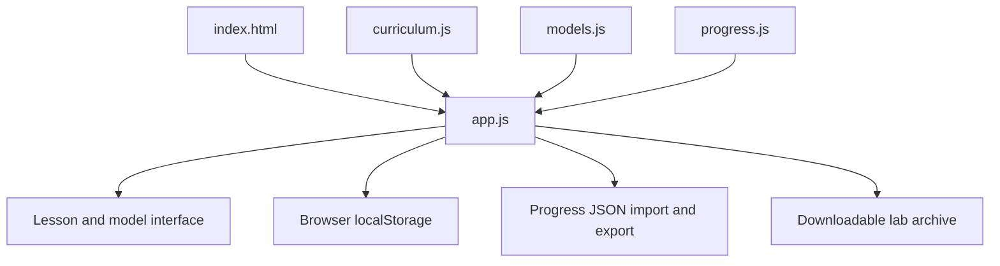

# Architecture

## Runtime

IC Pathway is a static, dependency-free browser application. `dist/` contains the authored website source. No transpiler, bundler, backend, or application-server build is needed.

| Source | Responsibility |
| --- | --- |
| `dist/index.html` | Metadata, navigation shell, and ordered script loading |
| `dist/style.css` | Responsive layout, states, reduced motion, and print styling |
| `dist/curriculum.js` | Lessons, references, exercises, answers, and stage metadata |
| `dist/models.js` | Pure shared sequential and timing teaching rules |
| `dist/progress.js` | Validation and normalization of imported/saved progress |
| `dist/app.js` | Routing, rendering, controls, feedback, and persistence |
| `lab/` | Canonical RTL, self-checking testbench, scripts, and instructions |
| `tools/package_lab.py` | Deterministic lab archive generation and freshness checks |
| `tests/validate.mjs` | Offline course, model, progress, asset, and consistency checks |
| `tests/hdl.py` | Actual Icarus parameter and defect-rejection tests |
| `.github/workflows/check.yml` | CI configuration for offline and HDL checks |
| `.github/workflows/pages.yml` | Optional manually triggered publication of `dist/` |

## Routing and content

Hash fragments such as `#bits` and `#counter` identify lessons. Unknown IDs resolve to the first lesson. Native links support history and bookmarks; the last visited valid lesson is saved locally.

A lesson contains a stable ID, stage, title, introduction, estimated reading time, goals, explanatory sections, pitfall, exercise/reference answer, knowledge check, and sources. Optional fields select a model, code block, download, or final checklist.

The English export preserves all 24 lesson IDs. All shipped UI and teaching text is English. Learners retain their own imported response text, regardless of its language.

## Progress data

The English app uses `ic-pathway.progress.en.v1` in localStorage.

| Field | Meaning |
| --- | --- |
| `schema` | Format version, currently 1 |
| `course` | Course identity, `ic-pathway` |
| `last` | Last valid lesson ID |
| `lessons` | Responses, option selections, passed checks, explicit completion flags |
| `acceptance` | Learner-confirmed practical evidence flags |
| `exportedAt` | Timestamp added when exporting |

Normalization accepts known lesson IDs, valid option indices, bounded strings, and Boolean evidence flags. Completion requires a nonempty response and a selected correct answer recorded as passed. Imported files are limited to 1 MiB. Import preserves completed lesson records; it is not automatic synchronization or a general conflict-resolution service.

If storage is unavailable, the app says so and retains export as a fallback. Clearing browser data can remove progress. User response text is assigned through text/textarea APIs rather than interpreted as HTML. Reference URLs are declared in the course data.

There are no app accounts, analytics, cloud progress storage, or school-server connections. A chosen host may maintain its own access logs.

## Models and real tools

Elementary bit/gate controls use direct deterministic calculations. Shared counter, pipeline, FSM, and timing rules live in `models.js` so their boundaries can be checked without a browser.

No editor buffer is compiled. The lab archive is generated at packaging time from canonical `lab/` files plus the project license. Icarus, VCS, and DC execute outside the website; credentials, licenses, and libraries never enter the app.

## Portability

Assets and downloads use relative URLs. Hash routes require no server rewrite rules. The site therefore supports a domain root and a repository subpath. Only `dist/` is published; tests, docs, and source lab files stay in the repository.

The export contains no private deployment identity, credentials, or original private repository history.
